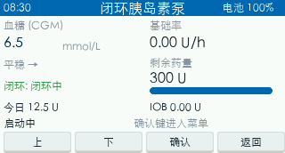
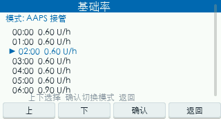
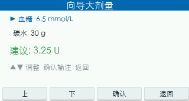
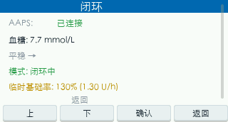
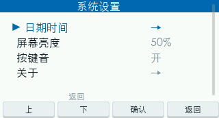

# 开源闭环胰岛素泵 DIY 项目（理论验证 / 教学原型）

> 📖 English documentation: [README_en.md](README_en.md)

<p align="center">
  
</p>

> ## 🚫🚫🚫 最高优先级警告 / CRITICAL WARNING
>
> **本项目是「理论验证 + 教学原型」性质的开源 DIY 项目，绝对、严禁用于任何人体（包括你自己）。**
>
> **This is a THEORETICAL / EDUCATIONAL prototype. It is NOT a medical device and MUST NOT be used on any human body — including yourself.**
>
> 它**未通过任何国家/地区监管机构（中国 NMPA、美国 FDA、欧盟 CE 等）的认证**，没有经过临床验证，没有可靠的精度校准、没有失效安全冗余、没有生物学兼容的给药通路。**把它用于人体注射胰岛素，可能造成低血糖昏迷、酮症酸中毒、严重伤害甚至死亡。** 一切后果由使用者自行承担，作者与贡献者不承担任何医疗、法律、经济责任。

---

## ⚠️ 安全声明与免责声明（务必先读）

1. **不是医疗器械**：本项目仅为开源 DIY 教学 / 研发 / 动物实验用途，不属于任何形式的医疗器械。
2. **严禁人体使用**：不得用于人类胰岛素注射、输注或任何进入人体/接触人体的给药场景。
3. **精度未经临床验证**：0.05U（0.5µL）目标精度仅停留在理论计算与桌面模拟层面，未经过计量标定、温漂补偿、长期老化测试。
4. **无失效安全冗余**：堵转、丢步、电池骤降、软件死锁等故障场景下，缺乏独立的硬件互锁（如机械止回阀、独立看门狗给药切断）。
5. **法律与责任**：作者与所有贡献者明确否认一切因使用、修改、分发本项目而产生的医疗、法律、经济责任。下载、克隆、派生本仓库即表示你已理解并同意上述声明。
6. **许可证中的免责**：本仓库代码采用 MIT 许可证、硬件采用 CERN-OHL-S 许可证，两者均**不含任何适销性或特定用途适用性的暗示担保**，且明确排除因使用本项目造成的损害赔偿责任（详见 `LICENSE` 与 `LICENSE-HARDWARE`）。

> 如果你正在寻找可用的闭环胰岛素治疗，请使用已获监管批准的商业设备（如 Medtronic、Tandem、Insulet 等）与合法注册的 AndroidAPS / Loop 等闭环系统（需配合合规硬件）。

---

## 1. 项目定位与目标

本项目尝试用 **ESP32-C6 + 低成本线性步进执行器** 复刻一款可对接 AAPS 闭环算法的胰岛素泵原型机，目标是把 BOM 成本压到千元以内，并完全开源软硬件。

| 项目 | 规格 |
|------|------|
| 主控 | ESP32-C6 1.47" LCD 开发板（WiFi6 + BLE5，板载天线） |
| 步进电机 | SM2012 线性执行器（12V 标称，11.1V 直供兼容，集成丝杠） |
| 电机驱动 | DRV8825（最高 1/32 细分，M0/M1/M2/nSLEEP 硬件固定） |
| 电池 | 3S 锂电池（11.1V 标称，18650×3，约 3000mAh） |
| 充电 | Type-C + 3S 专用 BMS（IP3002 / HY2213） |
| 降压 | DC-DC 11.1V→5V（系统供电）+ AMS1117-3.3（DRV8825 VDD） |
| 监测 | INA226 电流/电压采集（电机丢步/堵转/原点监护） |
| 注射精度 | **0.05U（0.5µL U-100 胰岛素）**（理论目标，未标定） |
| 通信 | BLE 5.0 GATT：AAPS **Dana-i impersonation**（方案 B，GATT `FFF0/FFF1/FFF2` + 自定义 Dana CRC + 两级加密）；Wi-Fi（OTA/调试） |
| 显示 | 1.47" LCD（ST7789，板载，172×320 横屏逻辑 320×172） |
| 操控 | 手机 APP（AAPS 插件 + 自研 APP）+ 4 键按键板 |
| 储药器 | 标准 3mL 注射器型储药器（丹纳PH300 / 优泵CY-13 兼容，300U） |

> **硬件平台（已确定）**：主控统一采用 **ESP32-C6 1.47" LCD 开发板**（RISC-V 内核，WiFi6+BLE5，板载 ST7789 屏）；电池 3S 11.1V（SM20 接口，入口 104 + 100µF/16V 滤波）；供电 DC-DC 降压 11.1V→5V；含 INA226 电流/电压监测与 4 键按键板；电机 11.1V 直供。DRV8825 保持不变。注：早期 Rev.1 曾评估 ESP32-C3 方案，现已**完全放弃，统一采用 ESP32-C6**。
>
> ⚠️ **硬件仍为「设计/打样阶段」，未做成可穿戴给药终端**。PCB、机械外壳、BOM 均为理论设计，请按 `docs/` 中说明自行评估风险。

---

## 2. 软件架构（模拟器 + 固件 + UI 抽象层）

为了让「界面逻辑」与「真实硬件」解耦、便于无硬件环境下快速验证，本项目采用 **UI-HAL 抽象层** 设计：

```
┌──────────────────────────────────────────────────────────────┐
│  ui_screen.cpp  (LVGL 9.5.0 界面 + 状态机显示 + 导航)         │  ← 双端完全共用
│      │  调用 ui_hal_* 接口读取数据 / 触发动作                  │
│      ▼                                                         │
│  ui_hal.h  (统一硬件抽象接口: 数据读取 + 动作)                 │
│      ├── ui_hal_sim.cpp   (PC 模拟器后端: mock 数据)           │
│      └── ui_hal_fw.cpp    (ESP32 固件后端: 接真实模块)         │
└──────────────────────────────────────────────────────────────┘
        │                                          │
   模拟器侧                                  固件侧
   SDL2 窗口渲染                          ST7789 SPI 渲染
   mock_hal (桩)                          motor/ina226/ble/safety…
```

- **`ui_screen.cpp`**：唯一一份界面代码，跑在模拟器与固件两端，保证 UI 与固件不会再次「脱节」。
- **`ui_hal.h`**：定义数据读取（血糖 / 趋势 / 闭环模式 / TBR / 今日总量 / 时钟 / 基础率）与动作（大剂量 / 排气 / 切换模式 / 清报警 / 背光 / 按键音）。
- **`basal_scheduler`**（新增）：3 分钟周期调度器，按本地档案 / 闭环下发 / TBR / 暂停计算当前基础率并入队电机微步，同时维护今日总量与储药器余量。
- **中文字体**：自研生成器（`gen_cn_font.py`，fontTools 子集化 + Pillow 渲染）输出 LVGL `fmt_txt`，**bpp=4 打包**，442 字，16px≈308KB / 12px≈198KB，适配 ESP32 4MB Flash。

### FreeRTOS 任务划分（固件）
`safety_task`（最高）· `motor_task` · `ble_task` · `battery_task` · `keypad_task` · `display_task` · `basal_scheduler_task`（新增）· 其余辅助任务。

### AAPS 闭环对接（Dana-i impersonation，方案 B）
固件通过 `aaps_dana.{h,cpp}` 模块 **impersonate 一台 Dana-i 胰岛素泵**，让已安装的 AndroidAPS 直接连上本设备、下发基础率 / 大剂量 / 方波 / TBR / 时间同步 / CGM，无需任何自定义 APP 或驱动补丁。
- **协议权威来源** = AndroidAPS `pump/danars` 模块（`BleEncryption.kt` + `DanaRSPacket*`），逐行确认后实现。
- **传输规格**：GATT `FFF0`(write) / `FFF1`(notify) / `FFF2`(write-no-response) + CCCD `2902`；信封 `A5 A5 len TYPE OPCODE params CRC16 5A 5A`；单字节 opcode 体系（`0x4A` 步进大剂量 / `0xC1` APS-TBR / `0x47` 方波 / `0x62` 停 TBR / `0x48` CGM / `0x02` 状态…）；设备名须正好 10 字符，匹配 `^[a-zA-Z]{3}[0-9]{5}[a-zA-Z]{2}$`。
- **安全**：一级信封 XOR 混淆（含 CRC_L）+ 二级 BLE_5 确定性字节混淆；握手（PUMP_CHECK / TIME_INFORMATION）期不做二级加密，握手完成后才启用。
- **字节级验证**：`test/aaps_dana_test.cpp`（g++ 纯逻辑）+ `test/oracle_aaps.py`（AAPS 源码转译预言机）→ `test/run_tests.sh` 抽取 `^PKT ` 行排序 diff，**205 个场景全部字节级匹配**（握手 / 命令响应 / 通知 / 200 随机命令包）。
- **真机实测待做**：需以 `config.h` 开 `USE_AAPS_DANA` + Arduino IDE 烧录 + 真实 AndroidAPS 配对（**仅空注射器 / 水**，严禁人体）。

---

## 3. UI 界面（模拟器预览）

界面为 **白底 + 医疗蓝（#006bb7）** 迈世通风格，**全中文**、横屏 320×172。以下截图均来自 PC 模拟器（SDL2 + LVGL 9.5.0），与固件共用同一份 `ui_screen.cpp`：

| 页面 | 截图 | 说明 |
|------|------|------|
| 主界面 |  | 血糖/趋势/闭环状态/今日总量/时间 |
| 菜单 |  | 基础率 / 大剂量 / 排气 / 报警 / 闭环 / 设置 |
| 基础率 |  | 本地档案 / AAPS 接管切换，24 槽速率 |
| 大剂量菜单 |  | 常规 / 方波 / 双波 / 向导 / 三餐 |
| 常规大剂量 |  | 0.05U 步进剂量输入 |
| 大剂量向导 |  | 碳水/当前血糖/IOB 建议量 |
| 报警 |  | 堵转/低电量/储药空/超限高亮 |
| 闭环 |  | AAPS 接管 / 开环本地 / 暂停 |
| 设置 |  | 背光 / 按键音 / 关于 |

> 注意：模拟器使用 `mock_hal` 桩函数制造演示数据，**不代表真实给药行为**。

---

## 3.1 AAPS 闭环联调同步演示（桌面，无需硬件）

把**真实固件命令核心**（`aaps_dana` + 剂量换算 + 调度器）编进 PC 模拟器，由脚本化的 17 步会话引擎驱动 `g_pump_state`，**泵屏幕每帧重绘即与 AAPS 命令严格同步**；另配一个 Python 控制面板做四路同步可视化，便于无硬件环境下向他人演示「AAPS 发令 → 固件收令 → 电机推药 → 泵屏响应」的完整闭环。

### 四路同步画面（控制面板 `test/link_demo_gui.py`）
| 面板 | 内容 | 数据来源（真实，非编造） |
|------|------|--------------------------|
| ① 步进电机推药 | canvas 画步进电机（转子随微步旋转）+ 丝杠 + 注射器柱塞随发药推进，标「已发药 X.XX U / 微步 N / 柱塞行程 mm」 | 固件 `motor_delivered_units_x100()` → `dosing.h` 单一真源换算 |
| ② AAPS 发送调试窗 | 每次 AAPS 经 BLE 发出的**原始在途字节** + opcode 名 + 人类意图（如「大剂量 2.00U」） | `dana_build_packet` 真实打包 |
| ③ 固件接收调试窗 | 固件解包（CRC / 类型）+ 实际分发动作（如 `motor_enqueue`）+ 回应原始字节；**篡改 CRC 的命令红显「被拒绝」** | `aaps_dana_feed_rx_test` 真实解包分发 |
| ④ 胰岛素泵屏幕 UI | canvas 复刻 320×172 横屏状态屏，随状态实时变化（也可直接看 SDL 真实窗口） | `g_pump_state` 每帧重绘 |

> ②③ 两窗的字节与动作是**真实的 Dana-i 协议**，不是模拟的——`link_session` 的发送函数真走 `dana_build_packet` 打包 + 固件 `aaps_dana_feed_rx_test` 解包分发，协议轨迹缓冲把每次收发抓下来同时喂给两窗。

### 一键启动（推荐）
```bash
# macOS 双击此文件即可全自动：构建联调版 → 启模拟器(弹泵屏窗口) → 启控制面板
open test/run_link_demo.command
# 或命令行
bash test/run_link_demo.sh
```
控制面板点 ▶ 播放即看四路同步演示。脚本会自动确保运行的是「联调版」二进制（通过构建模式标记 `.built_link_mode` 判断，避免切回 mock 后演示失效），关闭窗口时自动清理进程。

### 手动构建（可选）
```bash
bash test/build_sim_link.sh     # 构建联调版 (SIM_LINK_MODE=ON)，二进制在 /Users/feelingme/pump_sim_build/simulator
bash test/build_sim_mock.sh     # 切回普通 mock 模拟器
SIM_HEADLESS=1 /Users/feelingme/pump_sim_build/simulator &   # 无窗口模式(沙箱/无显示器)
python3 test/link_demo_gui.py                                # 连控制面板
```
- 验证（后台启模拟器 + 客户端驱动）：17/17 步、50 检查 0 失败；协议轨迹 18 条（含 1 条篡改被拒）；末态 `motor_units=2.00 / microsteps=4356`（2U×2178）。
- 纯逻辑冒烟另见 `test/link_mode_smoke.cpp`（不依赖 LVGL/SDL）。

---

## 4. 项目目录结构

```
闭环胰岛素泵项目/
├── README.md                 ← 本文件（项目总览 + 安全声明）
├── README_en.md              ← 英文版项目总览（面向国外读者）
├── CHANGELOG.md              ← 变更记录（含今日更新）
├── LICENSE                   ← 软件许可证（MIT + 免责）
├── LICENSE-HARDWARE          ← 硬件许可证（CERN-OHL-S + 免责）
├── NOTICE                    ← 安全 / 免责重点提示
├── docs/                     ← 技术文档（14 篇：系统/电源/电机/PCB/固件/AAPS/Android/机械/安全/测试/BOM/12-AAPS-Dana 协议/12-接线 + UI 设计）
├── code/
│   ├── esp32_firmware/       ← ESP32-C6 固件（Arduino 框架，Rev.2）
│   │   ├── esp32_firmware.ino     ← 主入口（setup/loop + FreeRTOS 任务）
│   │   ├── src/                   ← 全部模块 + lv_conf.h (LVGL 配置) / config.h (引脚与常量)
│   │   │   ├── ui_screen.{h,cpp}  ← 共用界面（白底中文，320×172）
│   │   │   ├── ui_hal.h           ← UI 硬件抽象接口
│   │   │   ├── ui_hal_fw.cpp      ← 固件后端（接真实模块）
│   │   │   ├── aaps_dana.{h,cpp}  ← AAPS Dana-i impersonation BLE 模块（方案 B）
│   │   │   ├── iob_model.{h,cpp}  ← IOB 模型（Walsh 三角衰减）
│   │   │   ├── rtc_clock.{h,cpp}  ← ESP32 硬件 RTC（无 49 天回绕）
│   │   │   ├── basal_scheduler.{h,cpp} ← 基础率周期调度器
│   │   │   ├── lv_font_cn_16.cpp / lv_font_cn_12.cpp ← bpp=4 中文字体
│   │   │   ├── pump_types.h / pump_state.{h,cpp} ← 状态机/CRC
│   │   │   ├── motor_controller.* / ina226.* / lcd_display.*
│   │   │   ├── keypad.* / battery_monitor.* / safety_monitor.*
│   │   │   ├── ble_comm.* / storage.* / history_log.*
│   │   │   └── power_manager.*
│   │   └── test/                 ← 宿主单元测试（aaps_dana 字节级验证 / 联调冒烟）
│   └── android_app/          ← Android APP（Kotlin + Compose）
├── simulator/
│   └── lvgl_sdl/             ← PC 模拟器（SDL2 + LVGL 9.5.0）
│       ├── README.md
│       ├── CMakeLists.txt    ← 含 SIM_LINK_MODE 选项（联调同步演示）
│       ├── src/              ← ui_screen/ui_hal/mock_hal/pump_state…
│       │                     ←   + link_session/link_ipc/ui_hal_link（联调引擎）
│       └── preview/          ← 11 页 UI 截图（见上）
├── test/                     ← AAPS 联调同步演示（link_demo_gui.py / run_link_demo.* / build_sim_*.sh / aaps_link_sim.cpp / host/）
├── pcb/                      ← PCB 原理图 / 布局 / Gerber
├── mechanical/               ← 机械 CAD / 3D 打印 / 图纸
├── diagrams/                 ← 系统框图
└── resources/                ← 数据手册、参考图
```

---

## 5. 硬件配置（Rev.2，设计阶段）

| 模块 | 关键器件 | 备注 |
|------|----------|------|
| 主控板 | Waveshare ESP32-C6-LCD-1.47 | ST7789 172×320 板载 LCD，GPIO8=WS2812 |
| 电机 | SM2012 线性执行器 | 200 步/转 + 1/32 细分 = 6400 微步/转，丝杠导程 0.5mm（待实测） |
| 驱动 | DRV8825 | VREF 目标 400mV |
| 电源 | 3S 11.1V（18650×3）+ DC-DC 5V | 系统供电；AMS1117-3.3 给 DRV8825 逻辑 |
| 监测 | INA226 | 电流/电压，堵转/丢步/原点监护 |
| 交互 | 4 键按键板 | 短按导航；长按 SET=原点，长按 ESC=关机 |

> 详细 BOM、原理图、机械设计见 [`docs/11-bom.md`](docs/11-bom.md)、[`docs/04-pcb-schematic.md`](docs/04-pcb-schematic.md)、[`docs/08-mechanical-design.md`](docs/08-mechanical-design.md)。**所有硬件数据均为理论设计，未经实物验证。**

### 5.1 硬件接线（快速参考）

> 🚫 理论验证用途，**严禁用于人体**；仅在断开电池、无药液、纯电路环境下接线。

**核心原则**：ESP32-C6 开发板（含屏）是主板，其余外设挂在它的 GPIO 上；所有模块必须共地；11.1V 只接电机/INA226/DC-DC，**绝不接 GPIO**。

| 外设 | 接 ESP32 的 GPIO | 关键说明 |
|------|------------------|----------|
| DRV8825 步进驱动 | STEP=**9** / DIR=**10** / ENABLE=**11**(低有效) / nFAULT→**16** | VMOT 接 11.1V，VDD 接 3.3V；M0/M1/M2 焊死 H/H/L=1/32 微步，nSLEEP/nRESET 硬件拉高 |
| SM2012 电机 | DRV8825 的 AOUT1/AOUT2、BOUT1/BOUT2 | 4 根线分 A/B 两相，接错只抖动不转，对调一组即可 |
| INA226 监测 | SDA=**18** / SCL=**19**（**必须显式指定，不可用默认 21/22**） | VCC 接 **3.3V**（勿接 5V，否则烧毁 C6）；VBUS 接 11.1V 母线；IN± 跨 20mΩ 分流电阻；A0/A1 接地=0x40 |
| 4 键按键板 | 上=**20** / 下=**23** / SET=**4** / ESC=**5** | 每键一端接 GPIO、一端接 GND（内上拉，低有效） |
| 限位开关 ×2 | 前进=**2** / 后退=**3** | 一端 GPIO、一端 GND |
| 蜂鸣器 | 信号=**0**（PWM） | 另一端 GND |
| WS2812 状态灯 | 板载 GPIO8 | 开发板已集成，不接 |
| DC-DC 使能(可选) | **17** | 模块无 EN 则悬空 |

- LCD 屏、USB、WS2812 均为**开发板板载**，无需接线；GPIO6/7/14/15/21/22 已被 LCD 占用，禁止复用。
- 完整接线表、电源树图、相位判定、检查清单见 👉 [**`docs/12-wiring.md`**](docs/12-wiring.md)。

---

## 6. 快速开始

### 6.1 推荐阅读顺序
1. [`docs/01-system-architecture.md`](docs/01-system-architecture.md) 系统整体
2. [`docs/02-power-system.md`](docs/02-power-system.md) 电源设计
3. [`docs/03-motor-drive.md`](docs/03-motor-drive.md) **0.05U 精度计算**
4. [`docs/05-firmware-design.md`](docs/05-firmware-design.md) 软件架构（含 ui_hal / 调度器 / BLE 协议）
5. [`docs/06-aaps-integration.md`](docs/06-aaps-integration.md) AAPS 对接
6. [`docs/09-safety-design.md`](docs/09-safety-design.md) 安全设计（**必读**）
7. [`docs/12-wiring.md`](docs/12-wiring.md) 硬件接线（**动手前必看**）
8. [`docs/11-bom.md`](docs/11-bom.md) 物料清单

### 6.2 PC 模拟器（无需硬件，最快验证 UI）
```bash
# 解法: macOS 路径不能含中文，用纯 ASCII 软链构建
ln -s "/Users/你的用户名/Desktop/闭环胰岛素泵项目/simulator/lvgl_sdl" ~/pump_sim
ln -s ~/pump_sim ~/pump_sim_build   # 或自行指定 out-of-source 构建目录
cd ~/pump_sim_build
cmake -G Ninja -B build ~/pump_sim
cmake --build build -j
./build/simulator            # 弹出 SDL2 窗口，键盘 ↑↓ 导航 / SET 确认 / ESC 返回
```
依赖：SDL2、CMake、Ninja、Python（fontTools + Pillow，用于 `gen_cn_font.py` 重新生成字体）。详见 [`simulator/lvgl_sdl/README.md`](simulator/lvgl_sdl/README.md)。

### 6.3 固件构建与烧录（推荐：预编译 bin）

**最简单**：直接用浏览器烧录预编译镜像，**无需在本机安装 Arduino / 编译**。
预编译镜像位于 `code/esp32_firmware/build_out/release/`：

- `pump_default_factory.bin`（默认变体）
- `pump_aaps_factory.bin`（AAPS Dana-i 伪装变体）

用浏览器打开 <https://esp.huhn.me> → 选端口 → 选 bin（偏移 `0x0`）→ 勾 Erase All → Flash。
详见 [`docs/13-烧录指南.md`](docs/13-烧录指南.md)（含 esptool / 乐鑫 Flash Download Tool / 从源码重编译 全部路径与排错）。

> **安全红线**：本项目是教学 / 理论验证原型，**不是医疗器械**，严禁用于任何人体；真机仅可用**空注射器 + 水**验证机械动作。

> ⚠️ **ST7789 关键陷阱**（已写入 `config.h` / `lcd_display.cpp`）：172 宽屏须设列偏移 `LCD_X_GAP=34`；颜色格式 `RGB565_SWAPPED`；GPIO8 为 WS2812 须用 `rgbLedWriteOrdered()`；INA226 的 I2C 须 `Wire.begin(18,19)`（21/22 已被 LCD 占用）。

### 6.4 Android APP
Kotlin + Jetpack Compose，44 个源文件，5 个 Compose 屏幕。BLE 协议与固件二进制 + CRC-8/CCITT 对齐，UUID 基础 `6E400001-B5A3-F393-E0A9-E50E24DCCA9E`。详见 [`docs/07-android-app.md`](docs/07-android-app.md)。

### 6.5 AAPS 闭环联调同步演示（桌面，无需硬件）
见上文 §3.1。一句话：`open test/run_link_demo.command`（macOS 双击）即全自动构建联调版模拟器、弹出泵屏窗口并启动四路同步控制面板；点 ▶ 播放看「① 电机推药 ② AAPS 发送 ③ 固件接收 ④ 泵屏 UI」实时联动。教学演示用，**严禁用于人体**。

---

## 7. 开发路线图

| 阶段 | 内容 | 状态 |
|------|------|------|
| Phase 0 | 方案设计与文档 | ✅ 完成 |
| Phase 1 | 固件 / 模拟器代码（含 ui_hal 抽象、基础率调度、BLE CRC 协议、AAPS Dana-i impersonation） | ✅ 完成（理论代码） |
| Phase 2 | 元件采购 + 面包板原型 | ⏳ 待启动 |
| Phase 3 | 电机单步精度验证（0.05U，需计量标定） | ⏳ 待启动 |
| Phase 4 | ESP32-C6 + DRV8825 联动测试 | ⏳ 待启动 |
| Phase 5 | BLE 通信 + Android APP 联调 | ⏳ 待启动 |
| Phase 6 | PCB 设计 + 3D 打印外壳 | ⏳ 待启动 |
| Phase 7 | AAPS 集成（Dana-i impersonation + 桌面联调同步演示验证） | ✅ 字节级 205 场景匹配 + 四宫格同步演示（真机实测 ⏳ 待启动） |
| Phase 8 | 安全验证 + 长期稳定性 | ⏳ 待启动（**最关键，未做不得人体使用**） |

---

## 8. 关键参考项目

| 项目 | 作者 | 特点 |
|------|------|------|
| Ultra-low-cost Insulin Pump | Lublin et al. | $89 BOM，AAA 电池（PMC9679028） |
| Arduino Insulin Pump | charan-271 | ESP32 + OLED + 步进电机 |
| Insulin Pump Prototype | AndreOliveira | ESP32 + Web 仪表盘 + 状态机 |
| InsulinManager | Kimpalele | ESP32-C3 + HM10 BLE + iOS App |
| 超低成本泵 | 中国研究团队 | ESP32 + DRV8833 + 大鼠实验验证 |
| OpenAPS / AndroidAPS | 社区 | 闭环算法参考实现 |

---

## 9. 许可证

- **软件（代码）**：MIT License —— 见 [`LICENSE`](LICENSE)。
- **硬件（PCB / 机械 / 原理图）**：CERN Open Hardware Licence v2 — Strongly Reciprocal (CERN-OHL-S) —— 见 [`LICENSE-HARDWARE`](LICENSE-HARDWARE)。
- 两份许可证均**明确排除适销性 / 特定用途适用性担保，并否认因使用本项目产生的损害赔偿责任**。
- 安全与免责重点提示另见 [`NOTICE`](NOTICE)。

> **再次强调**：开源 ≠ 可用作医疗设备。请严格遵守本文档顶部与 `NOTICE` 中的安全声明。

---

<p align="center">
  <b>🚫 本项目仅供学习、研发、动物实验，严禁用于人体。 🚫</b>
</p>
