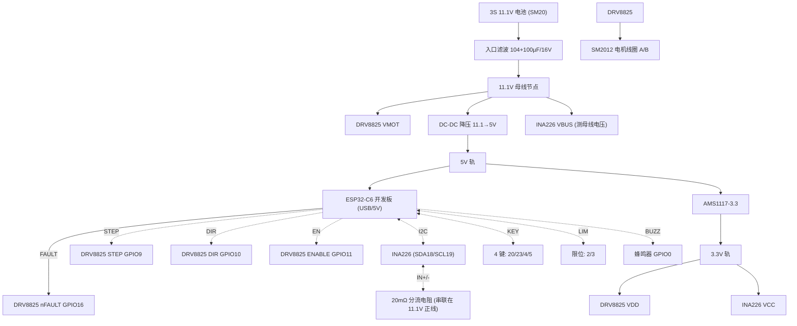

# 硬件接线指南（Rev.2，快速接线参考）

> ## 🚫 安全前置声明
> 本项目是**理论验证 / 教学原型**，**严禁用于人体、动物或任何真实给药场景**。
> 以下接线仅用于电路学习与桌面功能验证。胰岛素泵直接关联生命安全，任何自制设备未经
> 医疗器械认证即用于人体均属危险且违法。请仅在断开电池、无药液、纯电路实验环境下接线。

---

## 0. 一句话原则

- **ESP32-C6 开发板（含屏）是「主板」，其余都是挂在它上面的外设。**
- 所有「信号线」都从 ESP32 的 GPIO 接到外设对应脚；**所有模块必须共地（GND 连到一起）**。
- 电机功率（11.1V）和逻辑（3.3V）分开走，**千万别把 11.1V 接到 ESP32 的任意 GPIO 上**。

---

## 1. 接线总表（照这张表连即可）

| 外设 | 外设引脚 | 连到 ESP32-C6 | ESP32 GPIO | 说明 |
|------|----------|---------------|-----------|------|
| **DRV8825** | STEP | ← | **GPIO9** | 步进脉冲（高频） |
| | DIR | ← | **GPIO10** | 方向 |
| | ENABLE | ← | **GPIO11** | 低电平使能（默认拉高断开） |
| | nFAULT | → | **GPIO16** | 故障输出（低有效，输入） |
| | VMOT | ← | 11.1V 电源 | 电机动力电（**直供 11.1V**） |
| | VDD | ← | 3.3V | 逻辑电（AMS1117 输出） |
| | GND | ↔ | GND | 共地 |
| | M0 / M1 / M2 | — | 硬件焊死 H/H/L | 固定 1/32 微步，**不接 MCU** |
| | nSLEEP | — | 3.3V 上拉 | 硬拉高常唤醒，**不接 MCU** |
| | nRESET | — | 3.3V 经 10kΩ 上拉 | 硬上拉，**不接 MCU** |
| | AOUT1 / AOUT2 | → | 电机线圈 A | 接 SM2012 的 A 相两根 |
| | BOUT1 / BOUT2 | → | 电机线圈 B | 接 SM2012 的 B 相两根 |
| **SM2012 电机** | 4 芯线 | ↔ | DRV8825 AOUT/BOUT | 见 §4 相位判定 |
| **INA226** | SDA | ↔ | **GPIO18** | I²C 数据（必须显式指定引脚） |
| | SCL | ↔ | **GPIO19** | I²C 时钟 |
| | VCC | ← | 3.3V | **务必 3.3V**（见 §5 注意） |
| | GND | ↔ | GND | 共地 |
| | VBUS | ← | 11.1V 母线 | 测母线电压（最大 36V，直连安全） |
| | IN+ | ← | 分流电阻靠电池侧 | 测分流压差 |
| | IN− | ← | 分流电阻靠负载侧 | 测分流压差 |
| | A0 / A1 | — | GND | I²C 地址 = 0x40 |
| **4 键按键板** | 上 KEY | ← | **GPIO20** | 内上拉，另一端接 GND |
| | 下 KEY | ← | **GPIO23** | 内上拉，另一端接 GND |
| | 确认 SET | ← | **GPIO4** | 内上拉，另一端接 GND |
| | 取消 ESC | ← | **GPIO5** | 内上拉，另一端接 GND |
| **限位开关 ×2** | 前进限位 | ← | **GPIO2** | 内上拉，另一端接 GND |
| | 后退限位 | ← | **GPIO3** | 内上拉，另一端接 GND |
| **蜂鸣器** | +（信号） | ← | **GPIO0** | PWM 驱动；− 接 GND |
| **WS2812 状态灯** | — | 板载 | **GPIO8** | **开发板已集成，不接** |
| **DC-DC 使能(可选)** | EN | ← | **GPIO17** | 模块无 EN 则悬空 |

> LCD 屏、USB 口、WS2812 灯珠均为**开发板板载**，无需任何外部连线。
> GPIO6/7/14/15/21/22 已被 LCD 占用，禁止复用；GPIO1/12/13 为 USB 保留。

---

## 2. 连接关系图（Mermaid）



---

## 3. 电源树（文字版）

```
3S 11.1V 电池 (SM20 接口)
   │
   ├─ 入口滤波: 104 (0.1µF) + 100µF/16V 并联
   │
   ├─▶ INA226 VBUS        (测母线电压, 直接 11.1V, ≤36V 安全)
   ├─▶ DRV8825 VMOT       (电机动力电, 直接 11.1V)
   │
   └─▶ DC-DC 降压 11.1V → 5V
            │
            ├─▶ ESP32-C6 开发板 5V/VBUS (给 MCU + 板载 LCD)
            └─▶ AMS1117-3.3 → 3.3V
                     ├─▶ DRV8825 VDD (驱动逻辑电)
                     └─▶ INA226 VCC  (监测芯片逻辑电)

共地: 电池−、DC-DC GND、ESP32 GND、DRV8825 GND、INA226 GND 全部连到一起。
```

---

## 4. 步进电机相位判定（SM2012 4 根线怎么接）

SM2012 出来 4 根线，分两组（A 相 / B 相），每组两根。接错只会**不转或抖动**，不会烧：

1. 用万用表「电阻档」两两测 4 根线，相通的两根为**同一相**（电阻约几 Ω~几十 Ω）。
2. 把其中一组接 `AOUT1 / AOUT2`，另一组接 `BOUT1 / BOUT2`。
3. 若上电后电机**抖动不转或方向反**，把 A 相两根对调（或 B 相对调）即可，不影响安全。

---

## 5. INA226 分流电阻放置（关键）

- 取一只 **20mΩ / ≥1W** 的采样电阻，串联在 **11.1V 正线**上（电池 + 与系统母线之间）。
- `IN+` 接**靠电池一侧**，`IN−` 接**靠负载一侧**；`VBUS` 接负载侧母线（即系统 11.1V）。
- `A0`、`A1` 都接地 → I²C 地址 `0x40`。

> ⚠️ **设计注意（重要）**：INA226 的 `VCC` **必须接 3.3V**（来自 AMS1117），不要接 5V。
> 因为 ESP32-C6 的 GPIO **不耐受 5V**，I²C 上拉电平由 VCC 决定——若 VCC=5V，SDA/SCL 会被
> 拉到 5V 而损坏芯片。接 3.3V 可让 I²C 自然工作于 3.3V 安全电平，无需电平转换。

---

## 6. 按键板与限位开关接线

4 个按键、2 个限位开关都是「**一端接 GPIO，另一端接 GND**」的接法：

- ESP32 内部已开上拉，按键未按时 GPIO 读到高电平；按下时接通 GND 读到低电平。
- 所以**每个开关只需 2 根线**：信号线 + GND 线。无需外部电阻。
- 长按 SET = 设置电机原点；长按 ESC = 系统关机（见固件按键逻辑）。

```
按键/限位示意（以「上」键为例）:
   GPIO20 ──┐
            ├──[按键]── GND
   (内上拉) ┘
```

---

## 7. DRV8825 微步与使能的硬件固定

为省 GPIO，以下脚**在 PCB 上直接焊死/拉电阻**，不连 MCU：

| DRV8825 脚 | 接法 | 效果 |
|-----------|------|------|
| M0 / M1 / M2 | 3.3V / 3.3V / GND（H/H/L） | 固定 **1/32 微步** |
| nSLEEP | 3.3V 直连（或 10kΩ 上拉） | 常唤醒 |
| nRESET | 3.3V 经 10kΩ 上拉 | 不复位 |
| ENABLE | ← GPIO11 | 低=使能，高=断电刹车 |

---

## 8. 接线检查清单（上电前必做）

- [ ] **所有 GND 已连到一起**（电池−、DC-DC、ESP32、DRV8825、INA226）。
- [ ] 11.1V **只接到** DRV8825 VMOT、INA226 VBUS、DC-DC 输入；**绝不接到任何 GPIO**。
- [ ] DRV8825 VDD = 3.3V，INA226 VCC = 3.3V（不是 5V）。
- [ ] INA226 的 SDA/SCL 接的是 GPIO18/19，**不是**默认 I²C（21/22 被 LCD 占用）。
- [ ] 先**不接电池**，用 USB 给开发板供电，烧录并观察日志，确认无短路再接 11.1V。
- [ ] 电机先空转（无药液、无储药器）验证方向，再考虑机械负载。
- [ ] 蜂鸣器、按键、限位均为低电流信号，直接接 GPIO 即可。

---

## 9. 常见错误

| 现象 | 可能原因 |
|------|----------|
| 上电 ESP32 发黄/发烫 | 11.1V 误接到 GPIO 或 3.3V 轨；立即断电 |
| INA226 读不到 / 读到 0xFF | SDA/SCL 接成默认 21/22；或 VCC 误接 5V |
| 电机只抖不转 | A/B 相接反或某相开路；对调一组即可 |
| 按键无反应 | 忘了共地，或按键另一端没接 GND |
| LCD 不亮/花屏 | 开发板自带，检查 5V 供电与背光线（GPIO22） |

---

> 本接线指南对应 `code/esp32_firmware/src/config.h` 的引脚定义（Rev.2）。
> 所有连接均为**理论设计，未经实物验证**；请以实际模块 datasheet 与万用表测量为准。
